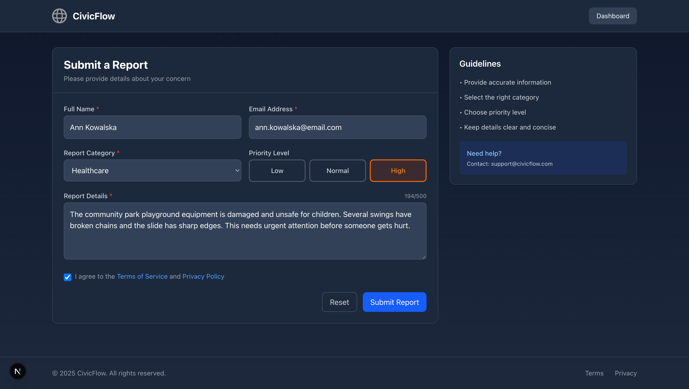
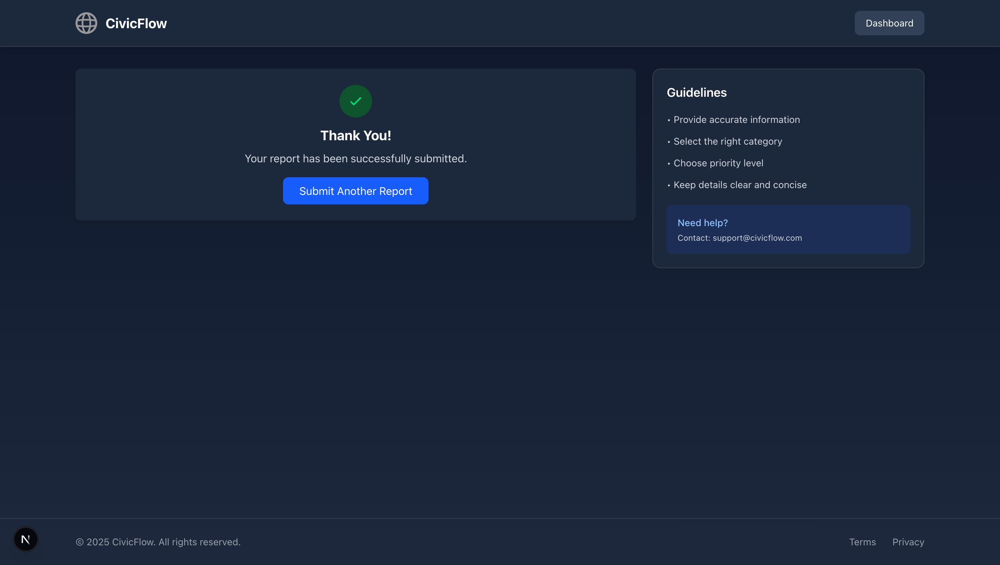
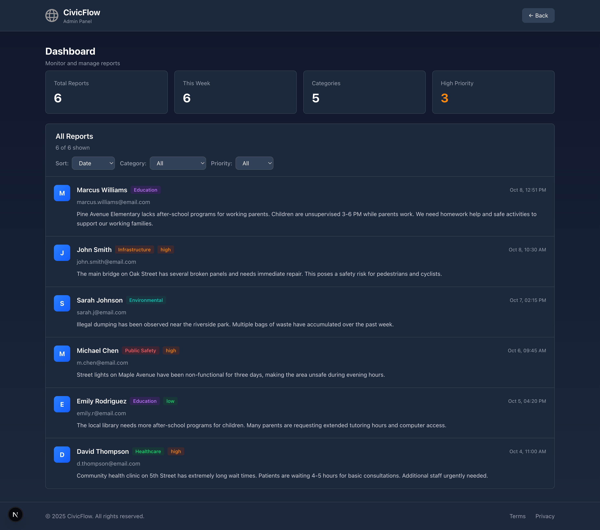

# CivicFlow

Civic issue reporting platform for local communities

## Overview

A modern web application where citizens can report local issues and administrators can manage them efficiently. Built with Next.js, Prisma, and TypeScript.

## Screenshots

### Screenshots

**Report Submission Form**

*Form with validation, character counter (500 max), 5 categories, 3 priority levels*

**Success Confirmation** 

*Green success banner with fade animation, form auto-reset, ready for next report*

**Admin Dashboard**

*4 stat cards, category/priority filters, date/priority/category sorting, status dropdowns, delete buttons*

## Tech Stack

- **Next.js 15.2.4** - React framework with App Router
- **Tailwind CSS 4.0** - Utility-first CSS framework
- **Prisma 6.5.0** - Type-safe ORM
- **SQLite** - Lightweight database
- **TypeScript 5.8** - Type safety
- **Zod 3.24** - Schema validation

## Quick Start

```bash
# Clone the repository
git clone https://github.com/NetBr3ak/civicflow.git
cd civicflow

# Install dependencies
npm install

# Setup database
npx prisma migrate dev
npx prisma generate

# Seed sample data (optional)
npm run seed

# Start development server
npm run dev
```

Open [http://localhost:3000](http://localhost:3000) to view the app

## Features

## Features

**Report Submission**
- 5 categories: Infrastructure, Education, Public Safety, Healthcare, Environmental
- 3 priority levels: Low, Normal, High
- 500 character limit with live counter
- Zod validation (name 2+, email format, message 5+)
- CSRF protection with custom token

**Admin Dashboard**  
- Statistics: Total, This Week, Categories, High Priority counts
- Filtering: By category and priority (dropdown selects)
- Sorting: Date (newest first), Priority (high→low), Category (A-Z)
- Status management: 4 states (Pending, In Progress, Resolved, Rejected)
- Safe deletion with JavaScript confirm dialog
- Real-time updates without page refresh

## Project Structure

```
civicflow/
├── app/
│   ├── api/report/          # REST API (GET, POST, PATCH, DELETE)
│   ├── dashboard/           # Admin management panel
│   ├── privacy/             # Privacy policy page
│   ├── terms/               # Terms of service page
│   ├── layout.tsx           # Root layout with global styles
│   └── page.tsx             # Main report submission form
├── lib/
│   └── prisma.ts            # Prisma client singleton
├── prisma/
│   ├── schema.prisma        # Database schema
│   └── migrations/          # Database migrations
├── public/
│   └── screenshots/         # App screenshots
└── scripts/
    └── seed.ts              # Database seeding script
```

## Usage

## Usage

**Submit Report**
1. Go to `/` (main page)
2. Fill: Name (2+ chars), Email (valid format), Category (required), Priority (optional, defaults to Normal)
3. Write message (5-500 characters, live counter shows remaining)
4. Click "Submit Report" → See green success message → Form resets

**Admin Panel**
1. Go to `/dashboard` → View 4 statistics cards
2. Filter by Category dropdown (All/Infrastructure/Education/Public Safety/Healthcare/Environmental)
3. Filter by Priority dropdown (All/Low/Normal/High)  
4. Sort by Date/Priority/Category using top dropdown
5. Change status: Click status dropdown → Select new status → Auto-saves
6. Delete: Click red "Delete" button → Confirm in popup → Report removed

## API Routes

### POST `/api/report`
Create a new report
```json
{
  "name": "John Doe",
  "email": "john@example.com",
  "category": "Infrastructure",
  "message": "Description of the issue",
  "priority": "high"
}
```

### GET `/api/report`
Retrieve all reports

### DELETE `/api/report?id={id}`
Delete a specific report

### PATCH `/api/report?id={id}`
Update report status
```json
{
  "status": "resolved"
}
```

## Database Schema

```prisma
model Report {
  id        Int      @id @default(autoincrement())
  name      String   // 2+ characters required
  email     String   // Valid email format
  category  String   // Infrastructure|Education|Public Safety|Healthcare|Environmental
  message   String   // 5-500 characters
  priority  String   @default("normal")  // low|normal|high
  status    String   @default("pending") // pending|in-progress|resolved|rejected
  createdAt DateTime @default(now())     // Auto timestamp
}
```


## Roadmap

## Roadmap

**Completed**
- [x] Full CRUD: Create, Read, Update status, Delete reports
- [x] Dashboard: 4 stats, 3 filters, 3 sort options, status management
- [x] Validation: Zod schema, CSRF tokens, character limits
- [x] UI: Dark mode, responsive, Tailwind styling

**Next Features**
- [ ] Authentication: Login system, role-based access (admin/user)
- [ ] Email: SMTP notifications on status changes, new reports
- [ ] Files: Photo/document uploads with preview
- [ ] Analytics: Charts, trends, export to CSV/PDF
- [ ] Public: Citizen view with report tracking by ID

## Contributing

Contributions are welcome! Please feel free to submit a Pull Request.

## License

MIT License - feel free to use this project for your own purposes.

---

**Built by NetBr3ak** | [GitHub](https://github.com/NetBr3ak/civicflow)