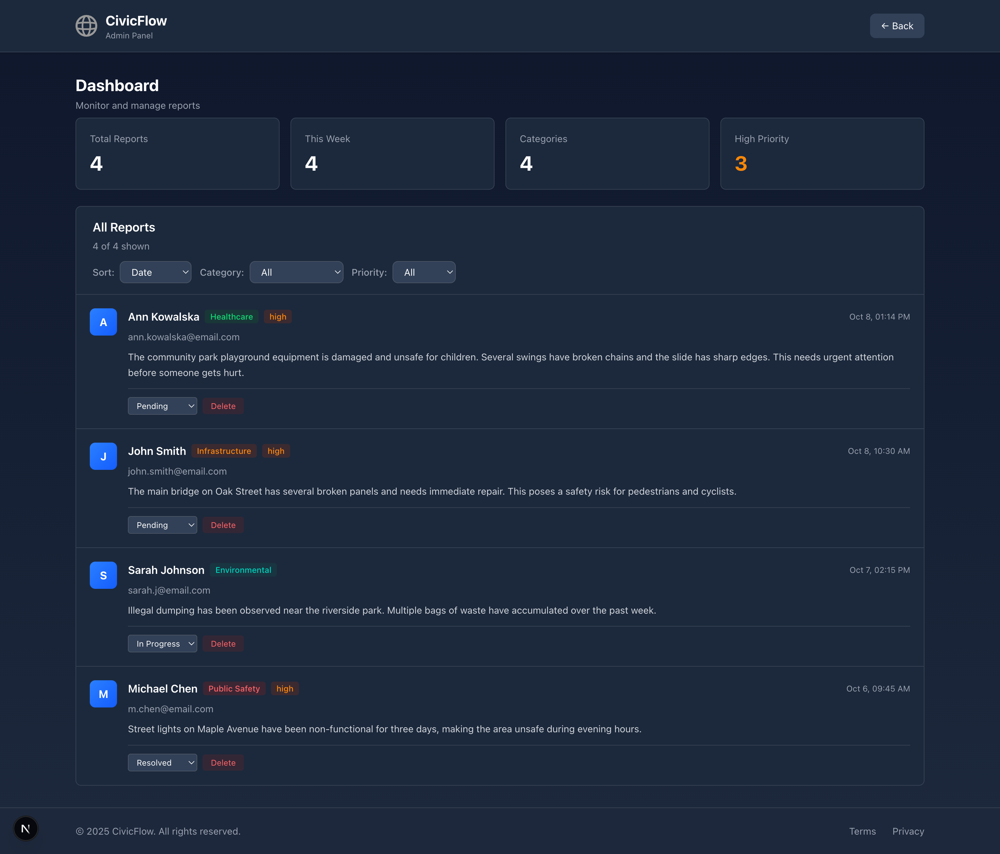

# CivicFlow

Civic issue reporting platform for local communities

## Overview

A modern web application where citizens can report local issues and administrators can manage them efficiently. Built with Next.js, Prisma, and TypeScript.

## Screenshots

### Report Submission Form

#### Before Submission

*Clean and intuitive form for submitting civic reports with category selection and priority levels*

#### After Submission

*Success confirmation with smooth fade-in animation after report submission*

### Admin Dashboard

*Professional dashboard with statistics, filtering, and sorting capabilities*

### Reports Management

*Comprehensive view of all submitted reports with detailed information and status indicators*

## tech stack

- Next.js
- Tailwind 
- Prisma
- SQLite
- TypeScript

## Quick Start

```bash
# Clone the repository
git clone https://github.com/NetBr3ak/civicflow.git
cd civicflow

# Install dependencies
npm install

# Setup database
npx prisma migrate dev
npx prisma generate

# Seed sample data (optional)
npm run seed

# Start development server
npm run dev
```

Open [http://localhost:3000](http://localhost:3000) to view the app

## Features

### Report Submission
- 📝 Submit reports with multiple categories (Infrastructure, Environmental, Public Safety, Healthcare, Education)
- ⚡ Priority levels (High, Normal, Low)
- ✅ Form validation with Zod
- 📊 Real-time character counter
- 🎨 Clean, professional UI

### Admin Dashboard
- 📈 Statistics overview (Total reports, This week, Categories, High priority)
- 🔍 Advanced filtering by category and priority
- 🗂️ Sorting by date, priority, or category
- 📋 Detailed report view with user information
- 🌓 Dark mode support
- 📱 Fully responsive design

### Technical Features
- ⚡ Built with Next.js 15 App Router
- 🎨 Tailwind CSS 4 for styling
- 💾 Prisma ORM with SQLite database
- 🔒 Type-safe with TypeScript
- 🚀 Optimized production build
- ♿ Accessible and semantic HTML

## Project Structure

```
civicflow/
├── app/
│   ├── api/report/          # API endpoints
│   ├── dashboard/           # Admin dashboard
│   ├── privacy/             # Privacy policy page
│   ├── terms/               # Terms of service page
│   └── page.tsx             # Main report form
├── lib/
│   └── prisma.ts            # Prisma client singleton
├── prisma/
│   ├── schema.prisma        # Database schema
│   └── migrations/          # Database migrations
├── public/
│   └── screenshots/         # App screenshots
└── scripts/
    └── seed.ts              # Database seeding script
```

## Usage

### Submit a Report
1. Navigate to the home page
2. Fill in your name and email
3. Select a category and priority level
4. Describe the issue
5. Submit the report

### View Reports (Admin)
1. Navigate to `/dashboard`
2. View statistics and all submitted reports
3. Use filters to find specific reports
4. Sort by date, priority, or category

## API Routes

### POST `/api/report`
Create a new report
```json
{
  "name": "John Doe",
  "email": "john@example.com",
  "category": "Infrastructure",
  "message": "Description of the issue",
  "priority": "high"
}
```

### GET `/api/report`
Retrieve all reports

## Database Schema

```prisma
model Report {
  id        Int      @id @default(autoincrement())
  name      String
  email     String
  category  String
  message   String
  priority  String   @default("normal")
  createdAt DateTime @default(now())
}
```

## Roadmap

- [ ] Email notifications for new reports
- [ ] File upload support for evidence
- [ ] Authentication system
- [ ] Report status tracking (Open, In Progress, Resolved)
- [ ] Email templates
- [ ] Export reports to CSV
- [ ] Report analytics and trends

## Contributing

Contributions are welcome! Please feel free to submit a Pull Request.

## License

MIT License - feel free to use this project for your own purposes.

---

**Built by NetBr3ak** | [GitHub](https://github.com/NetBr3ak/civicflow)